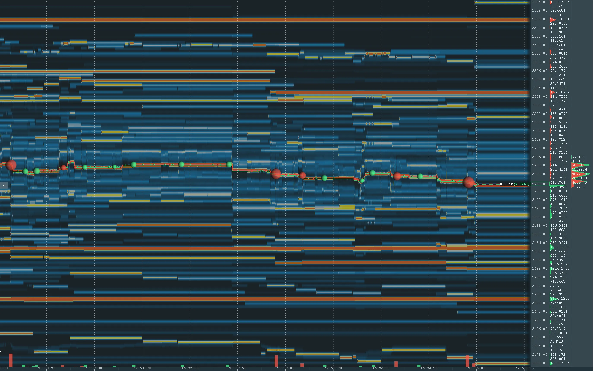
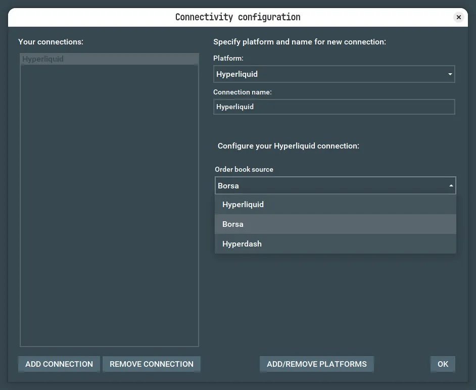

# Bookmap Hyperliquid Adapter

Read-only Bookmap Layer 0 market data for Hyperliquid perpetuals, including HIP-3
builder-deployed markets. The adapter loads perpetual metadata over REST, then publishes
aggregate L2 books and trades over one WebSocket. The `Order book source` dropdown selects
Hyperliquid (default), Borsa, or Hyperdash; the `Use Hyperliquid testnet` checkbox only applies
to Hyperliquid. It never requests credentials and never sends orders.



## Scope and behavior

The adapter supports the exact read-only perpetual scope exposed by Hyperliquid across every
perp dex:



- With the Hyperliquid source, the Mainnet/Testnet checkbox selects both the metadata REST
  endpoint and the market-data WebSocket. Borsa (`wss://ws.borsa.cc/`) and Hyperdash
  (`wss://api.hyperdash.com/ws/orderbook`) relay the Mainnet book, so they always load
  metadata from Hyperliquid Mainnet and ignore the checkbox.
- Borsa sends one full seed per connection followed by per-level deltas; the adapter folds the
  deltas locally and replaces the published book on every reconnect. Hyperdash sends full
  snapshots like Hyperliquid and requires browser-style handshake headers, which the adapter
  adds automatically. All three sources are subscribed with the price aggregation (nSigFigs /
  mantissa) that matches the Tick size chosen in Bookmap's Subscribe dialog; Borsa is
  additionally asked for nLevels=400, Hyperliquid ignores nLevels, and Hyperdash rejects it. The
  adapter does not verify either relay against Hyperliquid itself.
- Only `PERPETUAL` subscriptions are accepted; Spot, history, account data, credentials, orders,
  and gap filling are not implemented. Every live perpetual across every perp dex is listed,
  including HIP-3 markets, which keep their fully qualified `dex:coin` names (for example
  `xyz:CL`). Metadata is one `allPerpMetas` request; mark prices arrive continuously on the
  `fastAssetCtxs` WebSocket feed.
- Bookmap's Subscribe dialog upper-cases the symbol before it reaches the adapter, so a name that
  is not already upper-case — every HIP-3 market and the `k`-prefixed ones such as `kPEPE` — is
  matched case-insensitively. Two names differing only by case would be indistinguishable, so such
  a request is reported as not found rather than resolved to a guess. The instrument is then
  announced under the exchange's own spelling, with the upper-cased request handed back as
  `InstrumentInfo.requestedSymbol`, so Bookmap correlates the two and shows `xyz:CL` rather than
  `XYZ:CL` everywhere. That field requires Bookmap 7.8 or newer.
- Each subscription uses one `l2Book` feed and one `trades` feed on a single WebSocket. Hyperliquid
  and Hyperdash snapshots carry at most 20 levels per side; Borsa serves up to 400 levels per side.
  Coarser tick sizes therefore cover a wider price range with the same number of levels. Trades
  received while disconnected can be missed.
- The Tick size dropdown lists the ticks Hyperliquid's own order book offers for the instrument's
  price magnitude (for HYPE near 88: 0.001, 0.002, 0.005, 0.01, 0.1, 1), derived from that mark
  price. The default is the finest tick the exchange actually quotes at that magnitude. Books are
  kept on the lossless `10^-(6-szDecimals)` grid and aggregated on publish (bids round down, asks
  round up, sizes summed), so a stale tick from a saved workspace or a price that crosses a power
  of ten never corrupts the book; it only changes how many levels the server-side window covers.
  Mark prices are refreshed from the live feed, so the candidates follow the market without
  re-login.
- The native grid 10^-(6-szDecimals) is the lossless internal price unit; the Bookmap pips of a
  subscription is the tick chosen in the dialog, and trade prices are reported in units of that
  tick (fractions allowed).
- Metadata is validated as a complete universe before delisted instruments are filtered.

The adapter has no trading, order, account, credential, or private-user-data behavior. Order APIs
fail closed with a read-only system message.

## Build and install

Prerequisites are JDK 21 through JDK 25 and a shell capable of running the Gradle wrapper. JDK 20
or earlier and JDK 26 or later are rejected by the build; those environments require a prior
Gradle and quality-tool upgrade.

Use the system JDK normally. The repository's `references/jdk-25.0.4.1` directory is an explicit
`JAVA_HOME` or `-Dorg.gradle.java.home` fallback only when a system-JDK issue is being isolated;
it is not a general runtime selection mechanism.

```bash
./gradlew clean build
```

The adapter compiles to Java 8 bytecode. The thin adapter JAR is
`build/libs/hyperliquid-adapter-1.2.0.jar`; Bookmap supplies the API, Gson, and Jetty dependencies.
Load the module through its Bookmap annotations, or copy the JAR into the `API/Layer0ApiModules`
directory of the Bookmap installation. On Linux that path is:

```text
$HOME/.bookmap/API/Layer0ApiModules/hyperliquid-adapter-1.2.0.jar
```

## Operating limits

Connection attempts, open connections, outbound frames, and subscription slots are shared across
all adapter providers in the same JVM. Another Bookmap JVM/process, or another application using
the same public IP, is invisible to this in-process budget; operators must retain external
headroom for those consumers and for Hyperliquid's external limits.

The adapter uses per-side aggregate books of 20 levels (Hyperliquid, Hyperdash) or 400 levels
(Borsa) at the requested aggregation. During a disconnect, reconnect and full
resynchronization are attempted, but no historical gap fill is available and trades may be missed.
Borsa deltas are not self-healing: a delta dropped as stale or invalid leaves the published book
out of sync until the next reconnect, and a market-data queue overflow forces that reconnect so a
fresh seed replaces the book.

Borsa and Hyperdash reject the `fastAssetCtxs` feed, so those sources open a second WebSocket to
Hyperliquid Mainnet for mark prices. That connection is read-only, never affects login or the book,
and consumes one of the ten concurrent connections the in-process budget allows, which caps a single
JVM at five relay-backed providers.

On Testnet the instrument list holds roughly 630 symbols across about 200 perp dexes, most of them
throwaway markets deployed by other developers.

## Data freshness and gap notifications

Data-health transitions appear as Bookmap system messages and in the application log: WARN for
anomalies and INFO for recovery (subject to Bookmap's configured log level). Every message starts
with `data-status` and includes the selected source, environment, symbol (`*` for the mark-price
feed), connection generation, UTC time, and state-specific diagnostic details.

- `BOOK_STALE`: no valid book has been accepted for an active symbol for 30 seconds. An unchanged
  but valid book refreshes this timer; invalid or older books do not. This indicates reception
  inactivity, not proof of a feed failure, and does not force a reconnect.
- `BOOK_RESYNCING` / `BOOK_RESUMED`: a disconnect or market queue overflow requires a new book.
  Resumption is reported only after a replacement book is published, even if the connection's
  subscription acknowledgements have already arrived. `BOOK_RESUMED` also clears a stale warning.
- `TRADE_GAP_POSSIBLE` / `TRADE_RESUMED`: disconnects and market/trade buffer overflows may lose
  trades. A subsequent published trade ends the possible-gap interval, but historical trades
  are not backfilled. These intervals use local processing times, conservatively starting at
  the last published trade when known; they are not exact exchange-side missing-trade ranges.
- `MARK_PRICE_UNAVAILABLE` / `MARK_PRICE_RESUMED`: the mark-price connection failed or rejected
  its subscription, and subsequently delivered usable mark-price data. Reopening the socket
  alone does not clear the warning. Unchanging prices are not treated as a feed failure. A frame
  carrying no usable price keeps the last known prices instead of replacing them, so the warning's
  promise holds and the next frame still seeds the whole view.

The same ongoing condition is reported once. Recovery enables a new warning for a later incident.
Book freshness timers stop during resynchronization and are removed when a symbol is unsubscribed
or the session closes. Mark-price messages identify `feedSource=HYPERLIQUID` separately from the
selected order-book source; the two connections have independent generation numbers.

## Quality checks

Run the independent quality gates before distributing the JAR:

```bash
./gradlew --no-daemon spotlessCheck
./gradlew --no-daemon checkstyleMain checkstyleTest
./gradlew --no-daemon spotbugsMain
./gradlew --no-daemon test
./gradlew --no-daemon check
./gradlew --no-daemon clean build
```

SpotBugs HTML and XML reports are written under `build/reports/spotbugs`. The build's
`verifyJava8Bytecode` task checks that compiled classes use Java 8 major version 52.

